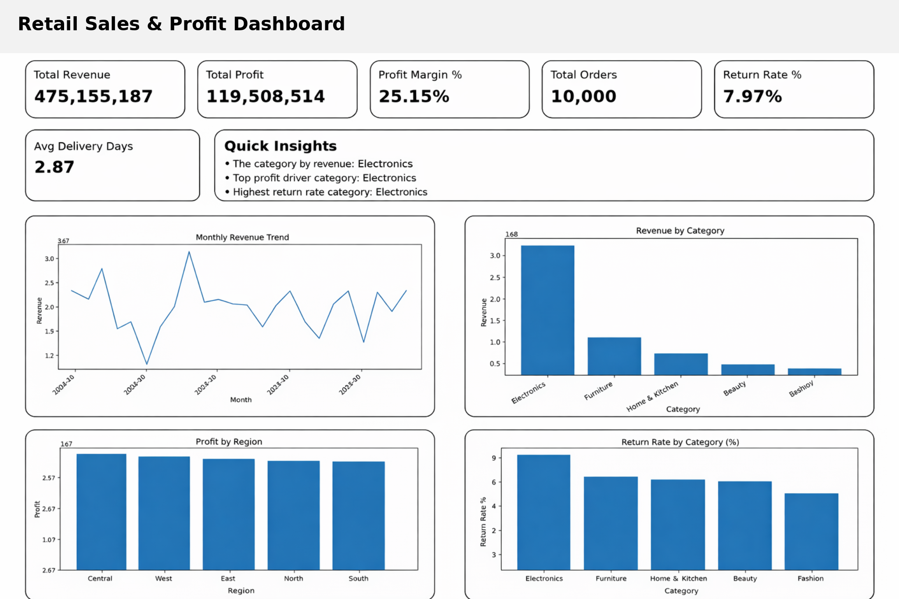
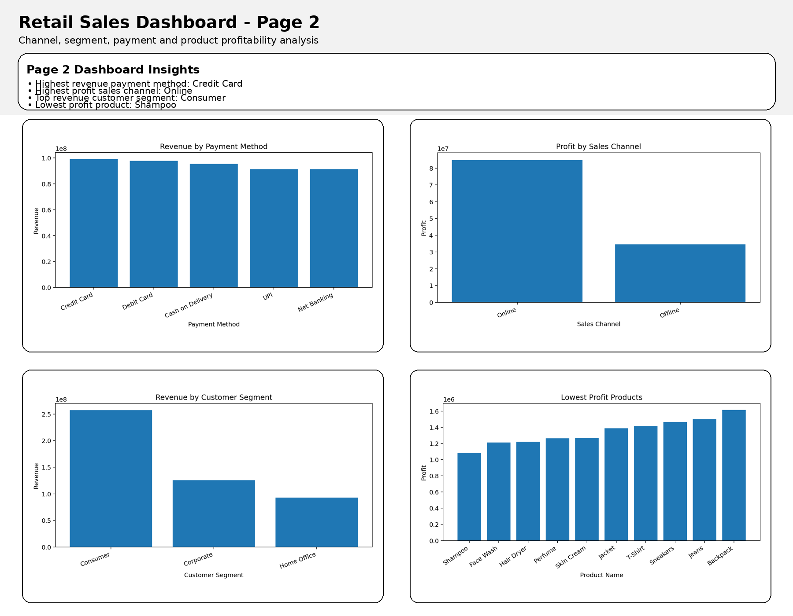

# 🚀 Retail Sales & Profit Analytics

## 📌 Overview

This project presents an end-to-end retail sales analytics solution using Python, SQL, and Power BI to analyze 10,000+ transactions and generate business insights.

## 🎯 Business Problem

Retail businesses need data-driven insights to improve revenue, profitability, and customer understanding. This project converts raw data into actionable insights.

## 📊 Project Highlights

* Analyzed 10,000+ retail transactions
* Performed data cleaning using Python
* Extracted insights using SQL
* Designed KPI-driven dashboard
* Created professional dashboard visuals

## 🛠️ Tools & Technologies

* Python (Pandas, NumPy, Matplotlib)
* SQL
* Power BI
* Excel

## 📂 Project Structure

pro_retail_sales_analytics/
│── dataset.csv
│── eda_analysis.py
│── sql_queries.sql
│── requirements.txt
│── powerbi_dashboard_guide.md
│── images/
│   ├── dashboard_preview_page1.png
│   └── dashboard_preview_page2.png

## 📈 Key KPIs

* Total Revenue
* Total Profit
* Profit Margin %
* Total Orders
* Return Rate %
* Average Delivery Days

## 🔍 Analysis Performed

* Revenue trend analysis
* Category-wise performance
* Region-wise profit
* Return rate analysis
* Payment method insights
* Customer segment analysis
* Product profitability

## 📊 Dashboard Preview

### Page 1: Sales & Profit Overview

### Page 2: Customer, Channel & Product Insights

## 💡 Key Insights

* Highest revenue from credit card payments
* Online channel gives highest profit
* Consumer segment contributes highest revenue
* Some products have low profitability

## 🧠 Skills Demonstrated

* Data Analysis
* SQL Query Writing
* Python Data Processing
* KPI Design
* Dashboard Planning
* Business Insight Generation

## 🚀 How to Run

pip install -r requirements.txt
python eda_analysis.py

## 💼 Use Case

This project simulates a real-world retail business scenario to improve decision-making using analytics.

## 👨‍💻 Author

Galla Divya Teja
Hyderabad
LinkedIn: https://www.linkedin.com/in/divya-teja-galla-7006592ba/
GitHub: https://github.com/TejaGalla
